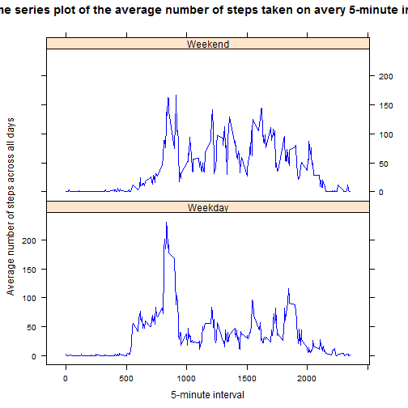

Reproducible Research: Peer Assessment 1
========================================================

## Introduction  

This assignment makes use of data from a person activity monitoring device. This device collects data at 5 minute intervals through out the day. The data consists  of two months of data from an anonymous individual collected during the months of October and November, 2012 and include the number of steps taken in 5 minute intervals each day.
  
## Loading and preprocessing the data

The raw data was read by read.csv and the variable "date" was converted to a date type variable. The data structure is very simple so I didn't make any other change.
  

```r
## Read data
activity <- read.csv("activity.csv")
activity$date <- as.Date(activity$date)
```

  

## What is mean total number of steps taken per day?

In order to see the pattern of the number of steps the person took every day, I made a histogram. The mean of total number of steps per day is 1.0766 &times; 10<sup>4</sup> which is close to its median (10765).  You can see that the distribution is bell shaped and centered around the mean. 
   

```r
#### What is mean total number of steps taken per day?  Calculate the
#### total number of steps taken per day
steps.total <- aggregate(steps ~ date, activity, sum)

## Histogram of the total number of steps taken each day
hist(steps.total$steps, col = "blue", breaks = 10, xlab = "Number of steps", 
    main = "Total number of steps taken per day")
```

 

```r

## Mean and median of the total number of steps taken per day
mean(steps.total$steps)
```

```
## [1] 10766
```

```r
median(steps.total$steps)
```

```
## [1] 10765
```


## What is the average daily activity pattern?
   
I made a time series plot of the 5-minute interval and the average number of steps taken, averaged across all days. I also indicated the maximum number of steps (206) on the plot. The maximum number of steps is on the 835^th 5-minute interval.    
   

```r
#### What is the average daily activity pattern?

## Calculate the average number of steps taken on avery 5-minute interval,
## averaged across all days
steps.average <- aggregate(steps ~ interval, activity, mean)

## Make a time series plot
xyplot(steps.average$steps ~ steps.average$interval, type = "l", xlab = "5-minute interval", 
    ylab = "Average number of steps across all days", main = "The time series plot of the average number of steps taken on avery 5-minute interval", 
    col = "blue", panel = function(x, y, ...) {
        panel.xyplot(x, y, type = "l")
        panel.abline(v = subset(steps.average, steps == max(steps))$interval, 
            lty = "dotted", col = "red")
    })
```

 

```r

## The 5-minute interval with the maximum average steps
subset(steps.average, steps == max(steps))$interval
```

```
## [1] 835
```

   

## Imputing missing values

The dataset has 2304 missing values. Those missing values are imputed by using the average number of steps taken on the corresponding intervals (averaged across all days). Later, a new dataset is created to have the missing data filled in. The mean (1.0766 &times; 10<sup>4</sup>) and median (10762) stay the same as those from the original data (1.0766 &times; 10<sup>4</sup> and 10765); however, the histogram plot is narrower and the total steps are more concentrated around means. It is because the days with missing values are imputed by average on 5-minute interval. After the imputation, more days are around the mean (median).
   

```r
#### Imputing missing values Calculate and report the total number of
#### missing values in the dataset (i.e. the total number of rows with NA
sum(is.na(activity$steps))
```

```
## [1] 2304
```

```r

activityx <- merge(activity, steps.average, by = "interval")
activityx1 <- activityx[is.na(activityx$steps.x), ]
activityx2 <- activityx[!is.na(activityx$steps.x), ]

## impute the missing values by the 5-minute average steps
steps <- as.integer(round(activityx1$steps.y))
activityx1$steps <- steps
activityx1$steps.x <- NULL
activityx1$steps.y <- NULL

## Retain the non-missing values
activityx2$steps.y <- NULL
colnames(activityx2)[2] <- "steps"

## Combine two dataframes to obtain a new dataset that is equal to the
## original dataset but with the missing data filled in.
activity.impute <- rbind(activityx1, activityx2)
activity.impute <- activity.impute[order(activity.impute$interval, activity.impute$date), 
    ]

## Calculate the total number of steps taken per day
steps.total.impute <- aggregate(steps ~ date, activity.impute, sum)

## Histogram of the total number of steps taken each day
hist(steps.total.impute$steps, col = "blue", breaks = 10, xlab = "Number of steps", 
    main = "Total number of steps taken per day for the imputted data")
```

 

```r

## Mean and median of the total number of steps taken per day
mean(steps.total.impute$steps)
```

```
## [1] 10766
```

```r
median(steps.total.impute$steps)
```

```
## [1] 10762
```

   

## Are there differences in activity patterns between weekdays and weekends?
I compared weekday and weekend activity on the average number of steps of the 5-minute intervals. The panel plot shows that the person was more active in the morning (around 6-7 am) and less active in the rest of the day during weekday days; however, on weekends, the person's activity level was pretty stable during the whole day (except the bed time). 


```r
### Are there differences in activity patterns between weekdays and
### weekends?

## Create a new factor variable in the dataset with two levels - 'weekday'
## and 'weekend' indicating whether a given date is a weekday or weekend
## day.
newvar <- weekdays(activity.impute$date)
newvarx <- as.factor(ifelse(newvar %in% c("Saturday", "Sunday"), "Weekend", 
    "Weekday"))
activity.impute$index.weekday <- newvarx

## Make a panel plot containing a time series plot of the 5-minute
## interval and the average number of steps taken, averaged accross all
## weekday days or weekend days.
steps.avg <- aggregate(steps ~ interval + index.weekday, activity.impute, mean)

xyplot(steps ~ interval | index.weekday, data = steps.avg, type = "l", layout = c(1, 
    2), xlab = "5-minute interval", ylab = "Average number of steps across all days", 
    main = "The time series plot of the average number of steps taken on avery 5-minute interval", 
    col = "blue", )
```

 


